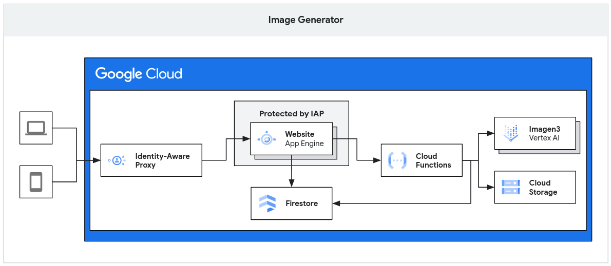
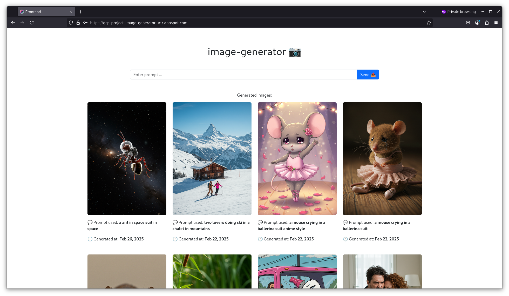

<h1>Image Generator</h1>

Image Generator is a web application that allows users to generate images based on text prompts.  The application provides a simple and intuitive interface where users can input a text prompt, and upon clicking the "Generate" button, an image is created based on their prompt. The generated images are then displayed in an history section below the input field.

This project is entirely hosted on Google Cloud and leverages several Google Cloud services to ensure its functionality and scalability.

<h1>Table of Contents</h1>

- [Quick Deployment Guide](#quick-deployment-guide)
  - [Prerequisites](#prerequisites)
  - [Deploying the Frontend on Google App Engine](#deploying-the-frontend-on-google-app-engine)
  - [Deploying the Backend Cloud Function](#deploying-the-backend-cloud-function)
  - [Important Considerations](#important-considerations)
- [Authors](#authors)


**Key Features:**

*   **Text-to-Image Generation:** Generate images from text prompts using the power of Vertex AI Imagen 3 API.
*   **Simple User Interface:**  Clean and easy-to-use interface with a prompt input field and image history display.
*   **Image History:**  Generated images are stored and displayed in a history section for easy access and review.
*   **Google Cloud Powered:**  Built and deployed entirely on Google Cloud Platform, ensuring reliability and scalability.

**Google Cloud Services Used:**

This project utilizes the following Google Cloud services to meet the project requirements, including the use of at least four cloud services and one serverless service:

1.  **App Engine:**  Used to host the frontend web application. App Engine provides a fully managed serverless platform that automatically scales the application based on traffic, making it ideal for hosting web applications efficiently.

2.  **Cloud Run Functions:**  Acts as the serverless backend of the application. When a user requests to generate an image, the frontend triggers a Cloud Run Function. This function is serverless, meaning it only runs when needed and scales automatically, optimizing resource usage and cost. The Cloud Run Function is responsible for:
    *   Calling the Vertex AI Imagen 3 API to generate the image based on the user's prompt.

3.  **Vertex AI Imagen 3 API:**  The core service for image generation.  Vertex AI Imagen 3 API provides state-of-the-art image generation capabilities, allowing the application to create high-quality images from text prompts.

4.  **Cloud Storage:** Used to store the generated images persistently. Cloud Storage provides scalable and durable object storage, ensuring that generated images are safely stored and easily accessible. Each generated image is saved as an object in a Cloud Storage bucket.

5.  **Firestore:**  Used as a NoSQL database to store metadata about the generated images. Firestore stores the URL of the image in Cloud Storage and the associated text prompt. This allows for easy retrieval and display of the image history within the application.





# Quick Deployment Guide

This section provides a quick guide to deploy the Image Generator website on Google App Engine and the backend Cloud Function.

## Prerequisites

*   A Google Cloud Platform (GCP) account.
*   The Google Cloud SDK (gcloud CLI) installed and configured.
    *   [Google Cloud SDK Installation Guide](https://cloud.google.com/sdk/docs/install)
*   Node.js and npm installed.

## Deploying the Frontend on Google App Engine

1.  **Navigate to the frontend directory:**

    ```bash
    cd frontend
    ```

2.  **Initialize App Engine (if not already initialized):**

    If you haven't initialized App Engine in your project before, run:

    ```bash
    gcloud app create
    ```
    Choose the region where you want to deploy your App Engine application.

3.  **Deploy the frontend:**

    Use the `gcloud app deploy` command from your frontend directory.

    Run the deployment command:

    ```bash
    gcloud app deploy app.yaml
    ```

4.  **Access your application:**

    Once deployed, you can access your application in your browser using the URL provided in the deployment output or by running:

    ```bash
    gcloud app browse
    ```

## Deploying the Backend Cloud Function

1.  **Navigate to the Cloud Function directory:**

    ```bash
    cd cloud_run_functions
    ```

2.  **Deploy the Cloud Function:**

    Use the `gcloud functions deploy` command to deploy your Cloud Function.

    ```bash
    gcloud functions deploy generate_and_store_image \
      --runtime python312 \
      --trigger-http \
      --memory 256MB \
      --allow-unauthenticated
    ```

3.  **Get the Cloud Function URL:**

    After deployment, you can get the URL of your Cloud Function using:

    ```bash
    gcloud functions describe generate_and_store_image --format='value(url)'
    ```

    You will need to configure your frontend application to call this Cloud Function URL when a user requests to generate an image.

## Important Considerations

*   **API Keys and Secrets:**  Make sure to securely manage your Vertex AI API key and any other secrets. Do not hardcode them in your code. Use environment variables or Google Cloud Secret Manager.
*   **Error Handling:** Implement proper error handling in both your frontend and backend to provide a better user experience.
*   **Cost Optimization:** Monitor your Google Cloud usage and optimize your services to minimize costs, especially for Cloud Run Functions and Vertex AI API usage.
*   **Security:**  For a production application, consider implementing authentication and authorization to secure your Cloud Function and API access.


# Authors

- [Romain LANCELOT](https://github.com/romainlancelot)
- [Jordan DUFRESNE](https://github.com/jordan95v)
- [Karl OELSCHLAGER](https://github.com/floonkaymon)
- [Thomas HUYNH](https://github.com/thomashuynh795/)
